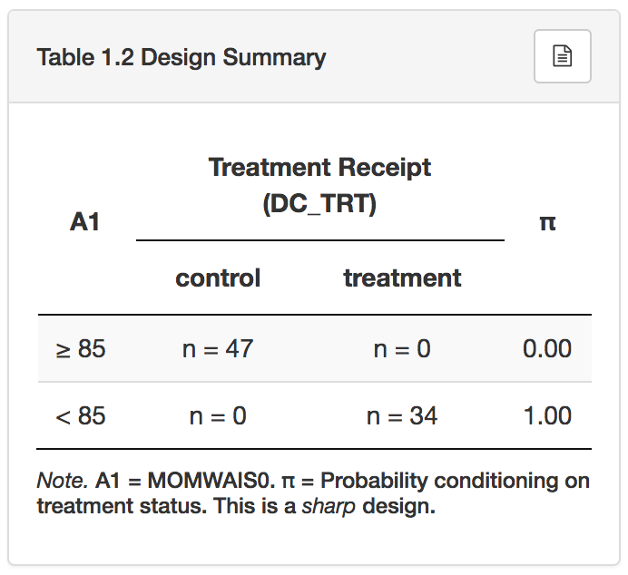

`rddapp` is an R package with an RShiny application for the analysis of regression-discontinuity designs (RDDs). It offers both parametric and non-parametric estimation of causal effects in RDDs, with one or two assignment variables. It also provides numerous assumption checks, and allows the estimation of statistical power.

## Online use
The Shiny environment of the `rddapp` can be accessed [online](https://rddapp.shinyapps.io/shinyrdd/). Untested features will first be introduced to the beta version, which can also be accessed [online](https://rddapp.shinyapps.io/shinyrdd_beta/).

The online Shiny environment is completely point-and-click, and no programming in R is required. Data for analysis can be uploaded directly to the Shiny server. However, sensitive data should not be transferred over the Internet, and the use of an offline client is preferred.

## Offline use
The easiest way to use the Shiny application offline is to download the official R package from [CRAN](https://cran.r-project.org/web/packages/rddapp/index.html), load the package in an R console, and execute the function `shiny_run()`. This will load the Shiny environment in the local browser, meaning that an online connection is not required (or used), and no data is transferred over the Internet.

## Interface
At the very top of the Shiny app are three tabs: [Model](#Model), [Power](#Power), and [More](#More).

* the [Model](#Model) tab contains all estimation modules;
* the [Power](#Power) tab contains all power analysis modules;
* the [More](#More) tab contains a Help page (with this manual), as well as a simple "About" page with software author information and references.  

## Model {#Model}
The model tab is subdivided into a data panel on the left, and a dynamic results panel on the right. The dynamic panel is not shown until data has been uploaded by the user.

### Data
Typically, the user will begin by uploading the data using the pull-down menu in the data upload panel (labeled "Data"):

<figure class="screenshot">

<figcaption>Data upload panel</figcaption>
</figure>

First, the user must specify the data file type. The choices are:

* a .SAV file (native file format of SPSS);
* a .CSV file (comma separated values).

The "Browse" button appears automatically when the user chooses a .SAV or .CSV file, and opens a file explorer from which the user can navigate to the data file for upload on their system.

For each of the two file types, the user can further fine-tune the data upload by clicking on the small button at the top right of the Data panel (in the shape of a gear). The gear button reveals additional options, and is updated dynamically based on user-chosen options.

#### .SAV file options

<figure class="screenshot">

<figcaption>.sav file options</figcaption>
</figure>

The "Use Value Labels" option allows a user to specify whether value labels from SPSS should be read into the uploaded datafile. For instance, a user may have coded a categorical variable 0 and 1 in SPSS, and included value labels "male" and "female". If "Use Value Labels" is selected, the actual labels will be displayed in the rddapp's analyses. Otherwise, the numbers will be used.

The "Use User's Missing Value" option instructs rddapp to code any user-specified missing values from SPSS as the symbol `NA` in the datafile (which has a [special meaning](https://www.statmethods.net/input/missingdata.html) in R). *IP: what is the alternative if this option is left unchecked but there are missing values?*

Finally, the user can indicate that the uploaded file has been "multiply imputed" in SPSS, which is usually done to deal with missing values. The user needs to provide the Imputation ID variable, and all analyses will then be performed on the multiply imputed datafile. In particular, this means that all analyses will be performed on each imputation, then estimates from the imputation will be averaged, and standard errors will be derived using Rubin's rules (1987), taking into account both the variation within imputations, and between imputations.

*Is more detailed needed here? And if so, should it appear here, or in some sort of technical appendix??*

*IP: I think that anyone who's done this in SPSS ought to know about it, so it's sufficient to remind then by linking to an existing resource about this in SPSS, like [this](https://www.uvm.edu/~dhowell/StatPages/Missing_Data/MissingDataSPSS.html) or [this](https://www.ibm.com/support/knowledgecenter/en/SSLVMB_24.0.0/spss/mva/idh_idd_mi_variables.html). I'm not sure if those are the best resources, but I included them for demonstration*

#### .CSV file options

<figure class="screenshot">

<figcaption>.csv file options</figcaption>
</figure>

If the user selects a .CSV file (comma separated values), the options under the gear button allow the user to specify exactly how the CSV file is structured. The user can specify:

* whether certain values are enclosed in quotes (double, single, or none);
* what kind of separator is used between values (comma, semi-colon, tab, or whitespace);
* whether missing values are blank by default or if a special character is used (e.g., `NA`);
* whether the file includes a header in the first line that includes the variable (column) names;
* whether the file is multiply imputed, and if so which variable is the imputation ID.

#### Sample data

The application also includes an example dataset, named "CARE". The dataset is a subsample of the Carolina Abecedarian Project and the Carolina Approach to Responsive Education (CARE) study. The full dataset is hosted by ICPSR and can be accessed here [http://www.icpsr.umich.edu/icpsrweb/ICPSR/studies/4091](http://www.icpsr.umich.edu/icpsrweb/ICPSR/studies/4091). The example dataset contains the following variables:

  1. `SUBJECT`: An ID variable for each subject.
  1. `DC_TRT`: An indicator of whether a child received the treatment or the control condition.
  1. `MOMWAIS0`: The IQ of the child's mother measured at baseline.  
  1. `HRI0`: A continuous index to assess whether a birth was high-risk.  
  1. `APGAR5`: The [APGAR](https://en.wikipedia.org/wiki/Apgar_score) score of the newborn infant.  
  1. `SBIQ48`: The IQ of the child at two years.  
  1. `RDD1_TR`: A constructed treatment indicator to demonstrate an RDD, as described below.
  1. `RDD2_TR`: A constructed treatment indicator to demonstrate a multiple-assignment RDD, also described below.

The original study was a randomized experiment, but for the purposes of the example, we created an RDD by selecting cases whose random treatment assignment coincided with an RDD-like decision rule. In particular, we assumed that an RDD could have been conducted in which children were assigned to the treatment condition if and only if the IQ of the mother at baseline was 85 or lower. The treatment assignment of units under such an RDD is contained in the `RDD1_TR` variable. In a second example, we assumed that treatment was assigned based on a bi-variate decision rule, namely that children were assigned to the treatment if their mother's IQ was 85 or lower, or the `APGAR` score was 3 or lower. The resulting treatment assignment is stored in a variable called `RDD2_TR`. Using `DC_TRT`, the experimental benchmark estimate of the treatment on IQ at 2 years can be computed, and then compared with estimates that can be derived using an RDD with the treatment indicators `RDD1_TR`, and `RDD2_TR`, respectively.
*Should the description of the datafile appear here on in an appendix?*
*IP: I like the idea of having the example dataset in the main help file because you can't really play with the example data without this infomation... I wonder if we should somehow link to this part of the web page in the app when the user selects the CARE data?*

### Model specification

Once the data are loaded, additional pull-down menus will appear. By default, pull-down boxes for the outcome variable, the assignment variable, and the treatment design will be shown directly underneath the data input box.

#### Outcome

<figure class="screenshot">

<figcaption>Outcome variable options</figcaption>
</figure>

The outcome box allows the user to define the outcome variable: the variable that the researcher assumes is affected by the treatment. Clicking the gear button opens additional options related to the analysis of the outcome variable. Here, the user can specify which kernel should be used for the non-parametric (local linear fitting) analysis (see [Estimation](#Estimation) for more detail). By default, a triangular kernel is chosen, as recommended by Imbens and Kalyanaraman (XXXX), but a variety of other kernels are available, as described by the following functions:

  1.) Triangular:   $K(u) = (1-|u|)$  
  2.) Rectangular:  $K(u) = 1/2$  
  3.) Epanechnikov: $K(u) = 3/4(1-u^2$)  
  4.) Quartic:      $K(u) = 15/16(1-u^2)^2$  
  5.) Triweight:    $K(u) = 35/32(1-u^2)^3$  
  6.) Tricube:      $K(u) = 70/81(1-|u|^3)^3$  
  7.) Gaussian:     $K(u) = 1/\sqrt(2\pi^{-1/2}u^2)$  
  8.) Cosine:       $K(u) = \pi/4\cos(\pi/2)u$  

*IP: Figure out how to add hyperlinked citations to this doc.*
*Check whether the new GUI actually still has kernels to choose from.*

The second option under the outcome tab is the type of standard error that should be used. ShinyRDD supports a "usual" standard error, that assumes constant variance ($\sigma ^2 (X'X)^{-1}$). In addition, all types of standard errors that are included in the R package `sandwich` (Zeileis, 2017) can be used. By default, a heteroskedasticty-robust standard error (HC1) is chosen. For details on the specific choices of heteroskedasticty-robust standard errors, consult Zeileis, 2006. **Lastly, for clustered data, a standard error that is robust to clustering can be chosen. Here, a cluster ID needs to be provided by the user. A pull-down menu to input this clustering ID opens automatically upon choosing this type of standard error.**

The last option under the outcome tab is called "auxiliary variables", where users can specify the use of auxiliary variables in the RDD. These variables are integrated in the regressions of the parameteric RDD. Purely linear terms are used for all auxiliary variables, and there is currently no support for non-linear terms. If users wanted to add non-linear terms, these would have to be created by hand first (e.g., polynomials) and entered as regular auxiliary variables. Furthermore, auxiliary variables will not be entered as interactive terms by default (interacting with treatment assignment). In a properly executed RDD, it should not be necessary to include auxiliary variables, but inclusion of them can in some instances increase precision of parameter estimates, and thus statistical power.

#### Treatment Design

<figure class="screenshot">

<figcaption>Treatment design options</figcaption>
</figure>

ShinyRDD allows the user fine-grained control over the actual treatment assignment status. The *treatment variable* encodes which treatment was _actually_ received by the participants. It is important to distinguish between the *assignment rule* and the *treatment variable* because in some designs, they may not be equal; not all participants that satisfy the treatment rule receive treatment (and some participants that do *not* satisfy the treatment rule may receive treatment). The treatment variable is entered in the box labeled "Treatment receipt".

The assignment rule, or treatment mechanism, is described by (a series) of "if" statements. In the pull-down menu under the label "IF", the user can choose the variable upon which the assignment rule is evaluated, and supply the value of the actual cut-off that was used to determine the treatment assignment status. The user can further change the inequality in the assignment condition by clicking on its icon. As an example, choosing an assignment variable and then selecting the greater than or equal symbol ($>=$) to with cut-off value 40, would mean that treatment was assigned to those individuals with assignment rule variable were equal or larger to 40.

Clicking the gear button, reveals one additional option; the user can specify whether individuals that were right at the cut-off were assigned to the treatment or control. By default, this option is selected, but when unselected, the inequality sign (e.g. $>=$) turns to a strict inequality (e.g. $>$).
Clicking the small "plus" button opens another dynamic menu in which a second assignment variable can be defined. This option accommodates multiple-assignment RDDs (currently up to two assignment variables). All other options that were available for the first assignment variable are also available for the second assignment.

Finally, the user must specify a variable that contains information about the actual treatment that was received. This is necessary for designs in which the assigned treatment and the received treatment may not be identical, so-called "fuzzy" RDDs.

### Data tab
As soon as data are loaded, the "Data" tab is populated with a spreadsheet-like display of the data. Variable names are displayed at the top, and users can navigate through the data, and sort by each of the variables. This display is mainly for purposes of validating that the data were read in correctly.
As soon as the outcome, and the treatment assignment variables are defined, the data tab is further populated with two additional tables.

<figure class="screenshot">

<figcaption>Table 1.1 for CARE data</figcaption>
</figure>

Table 1.1 shows descriptive statistics of the treatment variable (T), the assignment variable (A1 - and A2, is a second assignment was chosen), and the outcome variable (O). For each variable, three columns are reported: N (the sample size), M (the mean), and SD (the standard deviation). In addition, a small correlation matrix is shown on the side. The columns of this correlation matrix are labeled with T and O, indicating both treatment, and outcome variable. Within each corresponding row and column, the Pearson correlation coefficient among all three variables is shown in the lower triangle of the matrix. The information in the table can be downloaded as a .CSV file by clicking on the paper icon in the upper right corner of the panel.

<figure class="screenshot">

<figcaption>Table 1.2 for CARE data</figcaption>
</figure>

Table 1.2 summarizes the design of the RDD, and can serve as a check for the researcher that the design was correctly specified. The design summary consists of the sample sizes by treatment assignment and actual received treatment.

In the case of an RDD with a single assignment variable, A1, the actual treatment is given in the columns **(with labels control and treatment)**, and the assignment variable (along with the cut-offs) is given in the rows. In a sharp RDD (a design in which assigned and received treatment always coincide), the off-diagonal cell counts are always zero. In fuzzy designs, the off-diagonal elements will contain sample sizes of incorrectly classified individuals (where treatment assignment and received treatment do not coincide). A parameter $\pi$ is displayed, which is the probability of receiving treatment, conditional on being on either side of the threshold. $\pi$ is computed as a simple conditional probability, $\mathbb{P}(T=1|A1)$ (and not with a parametric model).

If a second assignment variable, A2, is specified, a second column is added to denote A2. The rows give all combinations of cut-offs, with their respective sample sizes, and the estimated $\pi$ parameter.

Under the table, ShinyRDD determines whether the design is sharp or fuzzy. In the case that one assignment variable does not alter any treatment assignment based on the other assignment variable, the app notes that the assignment variable in question is redundant, and call this an "ineffective assignment".

### Assumptions

The "Assumptions" tab is populated at the same time that the data are loaded, and the design is specified. The tab is divided into two sections. Figure 2.1. displays the results of the McCrary sorting test. This test is designed to detect discontinuities in the assignment variable. Under a valid RDD it is assumed that no such discontinuities exist, as they would imply the possibility that participants assigned themselves towards one side of the cut-off - a violation of the assumption that treatment is entirely determined by the assignment rule. The McCrary sorting test operates by estimating densities of binned data on each side of the cut-off, and then compares the height of the density curves at the cut-off. A test statistic (theta), standard error (se), z-value (z), and a p-value (p) are shown in the section labeled "Test summary". In most situations, users would like to see that this test is not significant, meaning that the hypothesis of no violation of the assumption fails to get rejected.

The user also has the option to fine-tune the sorting test. By default a specific bin width (for binning individual data points), and bandwidth (for the non-parametric density estimation) are chosen. These defaults were suggested by McCrary, and they depend on the particular dataset. Increasing the bin size will result in fewer points being used to estimate the density, whereas decreasing the bin size will result in more binned points. Likewise, an increase in the bandwidth will tend to make the density estimates more smooth, whereas a decrease in bandwidth will make the densities less smooth. Plots and test statistics are automatically updated as soon as these values are changed. Both plot and summary statistics can be downloaded by the user using the small buttons in the top right corner.

*IP: The sections below obviously haven't been written up yet, but I've included placeholder headings and anchors because they've been hyperlinked above.*

---

### Estimation {#Estimation}

---

## Power {#Power}

---

## More {#More}
