# Packages Summary

* [Package `rdd`](https://cran.r-project.org/web/packages/rdd/index.html)
* [Package `rdrobust`](https://cran.r-project.org/web/packages/rdrobust/index.html)
  - [Project `rdpackages`](https://sites.google.com/site/rdpackages/home)
  - [Functions `rddensity`](rddensity/rddensity-manual.pdf)
  - [Functions `rdlocrand`](rdlocrand/rdlocrand-manual.pdf)
* [Package `rddtools` (github/MatthieuStigler)](https://github.com/MatthieuStigler/RDDtools)
  - [`rddtools` (github/bquast)](https://github.com/bquast/rddtools)
  
## Estimation Functions ##

* `rdd`
  - `RDestimate(formula, data, subset = NULL, cutpoint = NULL,
    bw = NULL, kernel = "triangular", se.type = "HC1",
    cluster = NULL, verbose = FALSE, model = FALSE,
    frame = FALSE)`
    
* `rdrobust`
  - `rdrobust(y, x, subset = NULL, c = 0,  p = 1, q = 2, deriv = 0, 
            fuzzy = NULL, h = NULL, b = NULL, rho = NULL, scalepar = 1,
            kernel = "tri", bwselect = "CCT",  scaleregul = 1, delta = 0.5, 
            cvgrid_min = NULL, cvgrid_max = NULL, cvgrid_length = NULL, 
            cvplot = FALSE, vce = "nn", matches = 3, level = 95,
            all = FALSE)`
            
* `rddtools`
  - Parametric polynomial estimator `rdd_reg_lm(rdd_object, covariates = NULL, order = 1, bw = NULL,
  slope = c("separate", "same"), covar.opt = list(strategy = c("include",
  "residual"), slope = c("same", "separate"), bw = NULL),
  covar.strat = c("include", "residual"), weights)`
  - General polynomial estimator  `rdd_gen_reg(rdd_object, fun = glm, covariates = NULL, order = 1,
  bw = NULL, slope = c("separate", "same"), covar.opt = list(strategy =
  c("include", "residual"), slope = c("same", "separate"), bw = NULL), weights,
  ...)`
  - Non parametric estimator `rdd_reg_np(rdd_object, covariates = NULL, bw = rdd_bw_ik(rdd_object),
  slope = c("separate", "same"), inference = c("np", "lm"),
  covar.opt = list(slope = c("same", "separate"), bw = NULL))`
  
## Ploting Fuctions ##

* `rdd`
  - `plot(x, gran = 400, bins = 100, which = 1,
    range, ...)`
    
    > 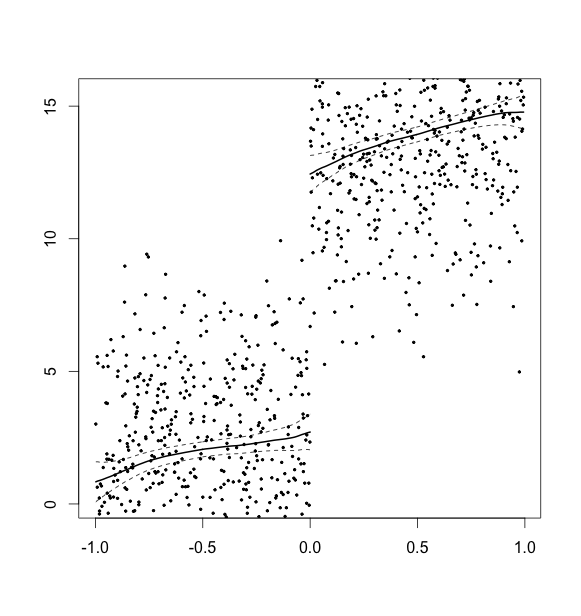
    
  - McCrary Sorting Test `DCdensity(runvar, cutpoint, bin = NULL, bw = NULL,
    verbose = FALSE, plot = TRUE, ext.out = FALSE)`
    
    > 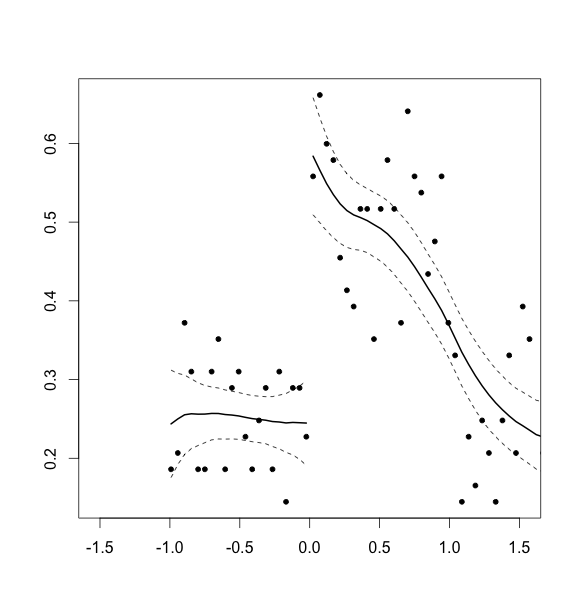
    
* `rdrobust`
  - Variance evenly-spaced method using spacings estimators `rdplot(y, x, subset = NULL, c = 0, p = 4, 
          numbinl = NULL, numbinr = NULL, binselect = "esmv", 
          lowerend = NULL, upperend = NULL, scale = 1, scalel = 1, scaler = 1, 
          hide = FALSE, par=NULL, title = NULL, x.label = NULL, y.label = NULL, 
          x.lim = NULL, y.lim = NULL, col.dots = NULL, col.lines = NULL, 
          type.dots = NULL,...)`
          
    > 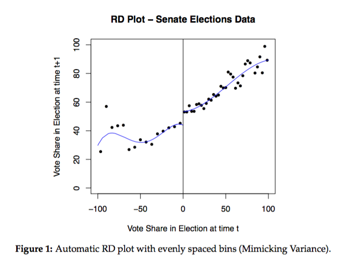
    
    + IMSE-optimal data-driven evenly-spaced and quantile-spaced RD plots `rdbinselect(y, x, subset = NULL, c = 0, p = 4, 
          numbinl = NULL, numbinr = NULL, binselect = "es", 
          lowerend = NULL, upperend = NULL, scale = 1, hide = FALSE, 
          par=NULL, title = NULL, x.label = NULL, y.label = NULL, 
          x.lim = NULL, y.lim = NULL)`
          
      > 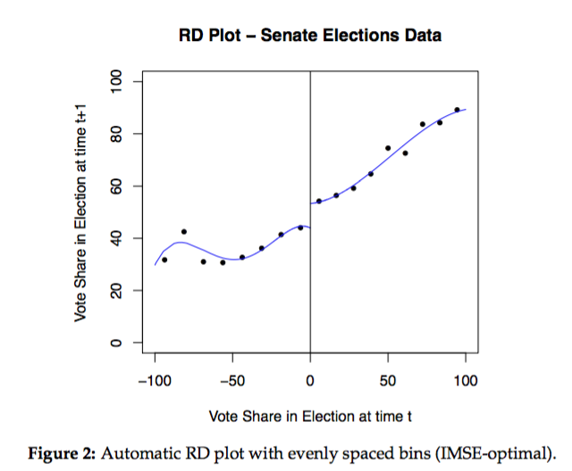
      > 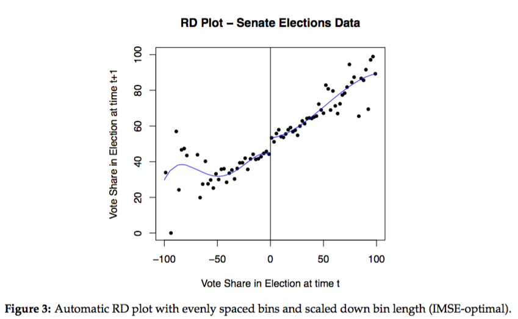
       
  - Bandwidth selection procedures for local-polynomial RD estimators `rdbwselect(y = vote, x = margin, bwselect = "CV", cvgrid_min = 10, 
          cvgrid_max = 80, cvplot = TRUE)`
    
    > 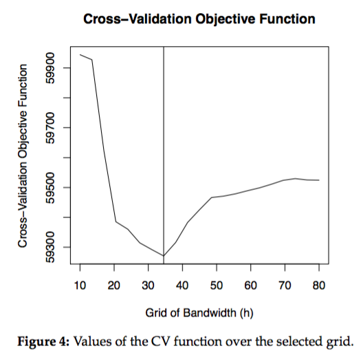

* `rddtools`
  - `plot(x, h, nbins = NULL, xlim = range(object$x, na.rm =
  TRUE), cex = 0.7, nplot = 1, device = c("base", "ggplot"), ...)`
     
    > 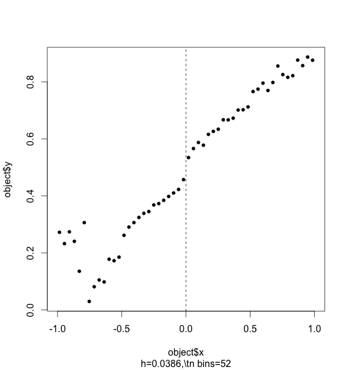
  
  - Placebo tests `plotPlacebo(object, device = c("ggplot", "base"),
  from = 0.25, to = 0.75, by = 0.1, level = 0.95, same_bw = FALSE,
  vcov. = NULL, plot = TRUE, output = c("data", "ggplot"), ...)`
    
    > 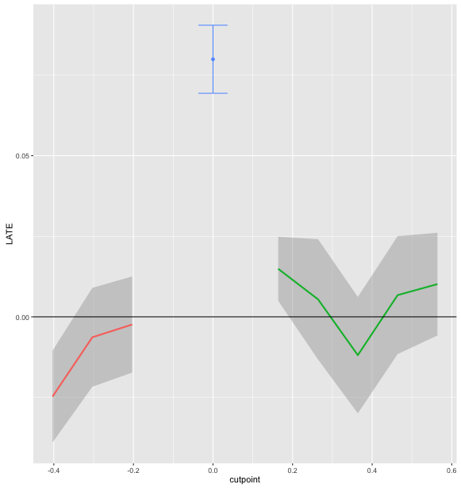
  
  - Sensitivity to the bandwidth `plotSensi.rdd_reg_np(rdd_regobject, from, to, by = 0.05,
  level = 0.95, output = c("data", "ggplot"), plot = TRUE,
  device = c("ggplot", "base"), vcov. = NULL, ...)`
    
    > 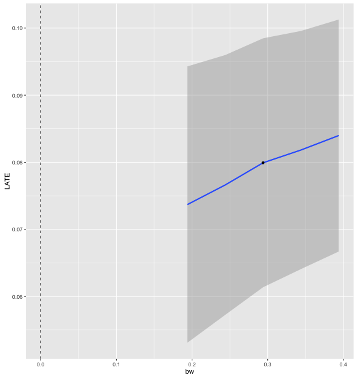
    > 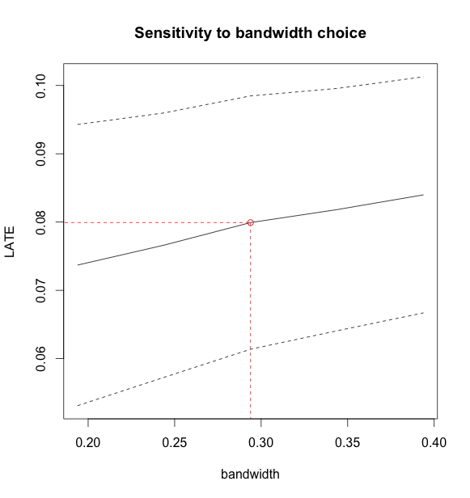
  
  - Sensitivity to the bandwidth `plotSensi.rdd_reg_lm(rdd_regobject, from, to, by = 0.05,
  level = 0.95, output = c("data", "ggplot"), plot = TRUE, order,
  type = c("colour", "facet"), ...)`
    
    > 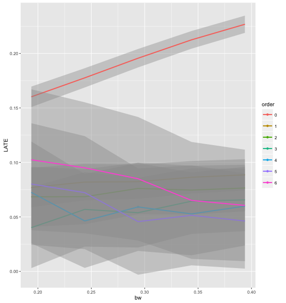
    > 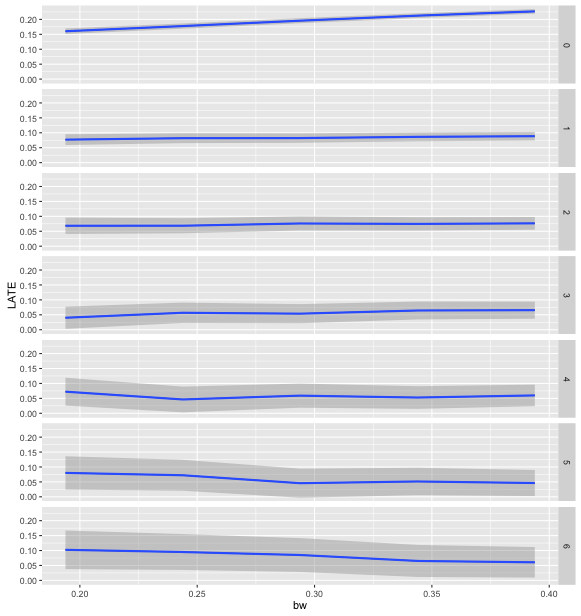

## Summarization Functions ##

* `rdd`
  - `summary.RD(object)`
    
    > ```Call:
    > RDestimate(formula = y ~ x | cov)
    > 
    > Type:
    > sharp 
    > 
    > Estimates:
    >            Bandwidth  Observations  Estimate  Std. Error  z value  Pr(>|z|)      
    > LATE       0.3973     398           2.195     0.2187      10.037   1.047e-23  ***
    > Half-BW    0.1987     211           2.231     0.2956       7.549   4.397e-14  ***
    > Double-BW  0.7947     808           1.940     0.1628      11.911   1.039e-32  ***
    > ---
    > Signif. codes:  0 '***' 0.001 '**' 0.01 '*' 0.05 '.' 0.1 ' ' 1
    > 
    > F-statistics:
    >            F       Num. DoF  Denom. DoF  p
    > LATE       128.27  5         392         0
    > Half-BW     53.43  5         205         0
    > Double-BW  531.57  5         802         0
    > ```
    
* `rddrobust`
  - `rdrobust(y, x, subset = NULL, c = 0,  p = 1, q = 2, deriv = 0, 
            fuzzy = NULL, h = NULL, b = NULL, rho = NULL, scalepar = 1,
            kernel = "tri", bwselect = "CCT",  scaleregul = 1, delta = 0.5, 
            cvgrid_min = NULL, cvgrid_max = NULL, cvgrid_length = NULL, 
            cvplot = FALSE, vce = "nn", matches = 3, level = 95,
            all = TRUE)`
    
    > ```Summary:
    >                         
    > Number of Obs 1000      
    > NN Matches    3         
    > BW Type       CCT       
    > Kernel Type   Triangular
    > 
    >                    Left   Right 
    > Number of Obs      199    196   
    > Order Loc Poly (p) 1      1     
    > Order Bias (q)     2      2     
    > BW Loc Poly (h)    0.4035 0.4035
    > BW Bias (b)        0.6074 0.6074
    > rho (h/b)          0.6643 0.6643
    > 
    > Estimates:
    >                Coef   Std. Err. z      P>|z|  CI Lower CI Upper
    > Conventional   2.0741 0.2188    9.4782 0.0000 1.6452   2.5030  
    > Bias-Corrected 2.0406 0.2188    9.3250 0.0000 1.6117   2.4695  
    > Robust         2.0406 0.2617    7.7984 0.0000 1.5277   2.5535   
    > ```
  
  -  `rdbinselect(y, x, subset = NULL, c = 0, p = 4,
          numbinl = NULL, numbinr = NULL, binselect = "es",
          lowerend = NULL, upperend = NULL, scale = 1, hide = FALSE,
          par=NULL, title = NULL, x.label = NULL, y.label = NULL,
          x.lim = NULL, y.lim = NULL)`
          
    > ```Call:
    > rdbinselect(y = y, x = x)
    > 
    > [1] Method:  Evenly-Spaced
    > 
    > 
    >                Left   Right 
    > Number of Obs. 487    513   
    > Poly. Order    4      4     
    > Number of Bins 9      9     
    > Scale          1      1     
    > Bin Length     0.1109 0.1106
    > ```

* `rddtools`
  - `print.rdd_reg_lm()`
    
    > ```### RDD regression: parametric ###
    > 	Polynomial order:  1 
    > 	Slopes:  separate 
    > 	Number of obs: 6558 (left: 2740, right: 3818)
    > 
    > 	Coefficient:
    >    Estimate Std. Error t value  Pr(>|t|)    
    > D 0.1182314  0.0056799  20.816 < 2.2e-16 ***
    > ---
    > Signif. codes:  0 ‘***’ 0.001 ‘**’ 0.01 ‘*’ 0.05 ‘.’ 0.1 ‘ ’ 1
    > ```
    
  - `print.rdd_reg_np()`
    
    > ```### RDD regression: nonparametric local linear###
    > 	Bandwidth:  0.2938561 
    > 	Number of obs: 3200 (left: 1594, right: 1606)
    > 
    > 	Coefficient:
    >   Estimate Std. Error z value  Pr(>|z|)    
    > D 0.079924   0.009465  8.4443 < 2.2e-16 ***
    > ---
    > Signif. codes:  0 ‘***’ 0.001 ‘**’ 0.01 ‘*’ 0.05 ‘.’ 0.1 ‘ ’ 1
    > ```
    
## Auxiliary Functions ##

* `rdd`
  - Imbens-Kalyanaraman Optimal Bandwidth Calculation `IKbandwidth(X, Y,
    cutpoint = NULL, verbose = FALSE,
    kernel = "triangular")`
  - McCrary Sorting Test `DCdensity (runvar, cutpoint, bin = NULL, bw = NULL,
    verbose = FALSE, plot = TRUE, ext.out = FALSE)`
  - Kernel Weighting function `kernelwts(X, center, bw, kernel = "triangular")`
  
* `rdrobust`
  - `bwconst()` 
  - `kweight()`
  - `qrreg()`
  - `qrXXinv()`
  - `rdvce()`
  - `regconst()`
  
* `rddtools`
  - conversion
    + `as.lm()` Convert a rdd object to lm
    + `as.npreg()` Convert an rdd_reg object to a 'npreg' object
    + `as.npregbw()` Convert an rdd_reg object to a 'npreg' object 
  - RDD coefficient prediction `rdd_pred(object, covdata, se.fit = TRUE, vcov. = NULL, newdata,
  stat = c("identity", "sum", "mean"), weights)`
  - Retrieve RDD coefficient `rdd_coef(object, allInfo = FALSE, allCo = FALSE, ...)`
  - Bandwidth selector
    + Imbens-Kalyanaraman Optimal Bandwidth Calculation `rdd_bw_ik(rdd_object, kernel = c("Triangular", "Uniform", "Normal"))`
    + Global bandwidth selector of Ruppert, Sheather and Wand (1995) from package `KernSmooth`
     `rdd_bw_rsw(object, type = c("global", "sided"))`
  - Test for balanced covariates
    + Equality of distribution `covarTest_dis(object, bw, exact = NULL, p.adjust = c("none", "holm", "BH",  "BY", "hochberg", "hommel", "bonferroni"))`
    + Equality of mean with t-test `covarTest_mean(object, bw = NULL, paired = FALSE, var.equal = FALSE,  p.adjust = c("none", "holm", "BH", "BY", "hochberg", "hommel",
  "bonferroni"))`
  - McCracy test from `rdd` `dens_test(rdd_object, bin = NULL, bw = NULL, plot = TRUE, ...)`
  - Robust SE 
    + Post-inference for clustered data `clusterInf(object, clusterVar, vcov. = NULL, type = c("df-adj", "HC"), ...)`
    + Cluster Heteroskedasticity-consistent estimation of the covariance matrix (`called by clusterInf()`) `vcovCluster(object, clusterVar)`
  - `waldci()`

    
    
  
    
    


